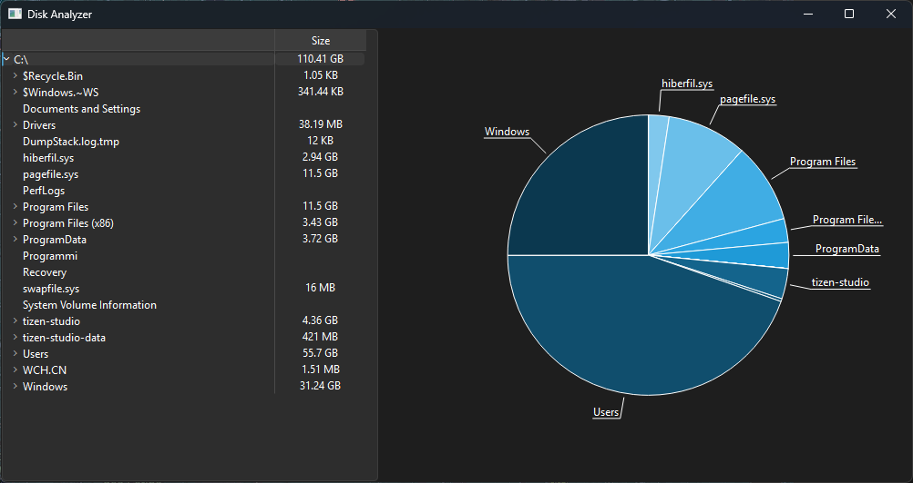

# DiskAnalyzer

DiskAnalyzer is a tool based on the [PyQt6](https://pypi.org/project/PyQt6/) library, tought for easily visualize the amount of space occupied by the files and where they are located in the file system. The tool provides a user-friendly graphical interface which allows to browse through the directories and visualize the space distribution on a pie chart.

